# Fetal Head Circumference Estimation via Cine-Loop Segmentation

> **Course Project — CSCE 6260, Fall 2025**  
> Tarun Sadarla · Ramyasri Murugesan · University of North Texas

---

## Overview

Manual fetal head circumference (HC) measurement from 2D ultrasound is subjective and prone to inter-observer variability. This project builds an end-to-end pipeline that extends **static-frame segmentation to temporally-aware cine-loop analysis**, improving measurement consistency across sequential ultrasound frames.

Two parallel systems were developed and compared:

| System | Approach | Best Dice | HC MAE |
|--------|----------|-----------|--------|
| **Baseline** | Residual U-Net on static HC18 frames | 86.17% | 17.25 mm |
| **Ours (Cine-Loop)** | 3D U-Net + Pseudo-LDDM simulation | 90.88% (boundary Dice) | 25.95 mm (400 samples) |

---

## Team Contributions

This is a 2-person team project. Contributions are divided as follows:

**Tarun Sadarla** (this repo)
- Full baseline pipeline: preprocessing variants (RAW/SEG/IMP/SKL), Residual U-Net training, post-processing, ellipse-fitting, HC computation, and evaluation
- Literature review (joint)

**Ramyasri Murugesan**
- Full Pseudo-LDDM cine-loop simulation framework (all 4 phases)
- Cine-loop preprocessing pipeline
- Literature review (joint)

**Joint contributions**
- 3D U-Net architecture design and training pipeline
- Temporal stability module and reliability layer
- Final evaluation, results analysis, and presentation

---

## Pipeline

### Baseline Pipeline

```
HC18 Dataset → Preprocessing (4 variants) → Data Augmentation → Residual U-Net → Post-Processing → Ellipse Fitting → HC Computation
```


**Preprocessing steps:** grayscale conversion → resize → median/Gaussian/Wiener denoising → Sobel edge detection → k-means clustering → morphological refinement → skeletonization


#### Preprocessing Variants (sample grids)

RAW — minimal preprocessing (best performer):
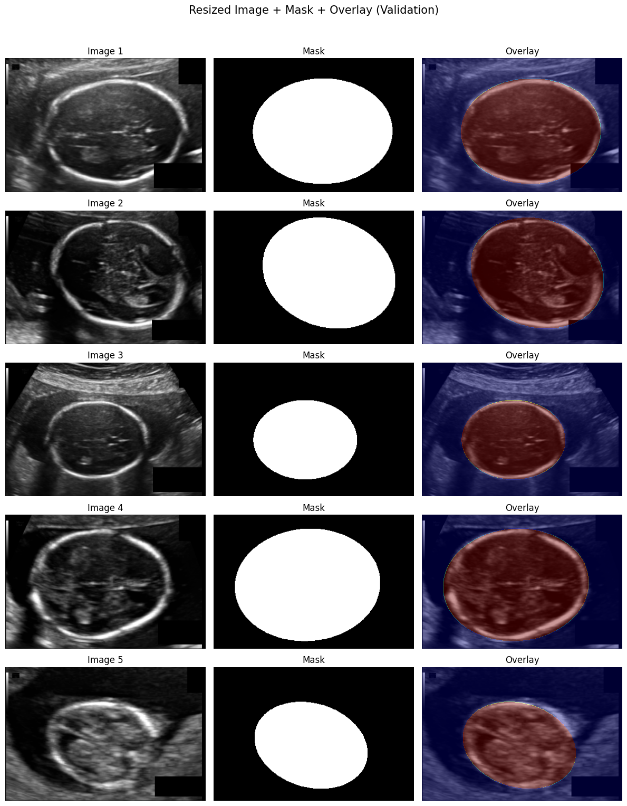

SEG — standard segmentation preprocessing:
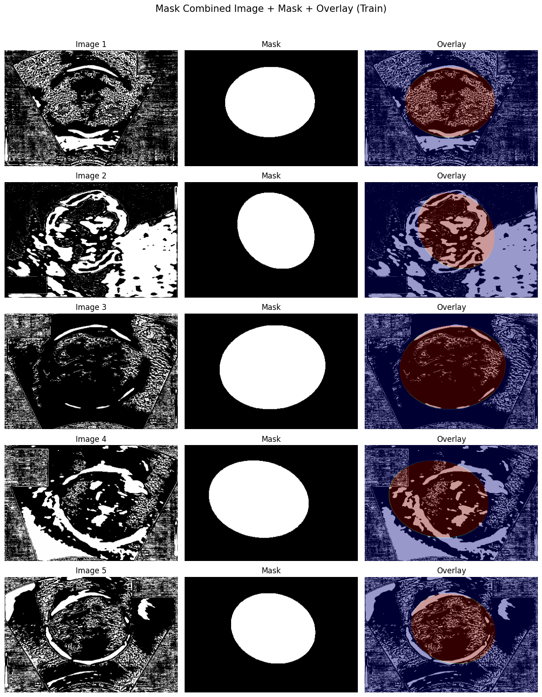

#### Sanity Check: Image + Ground Truth Mask Pairs

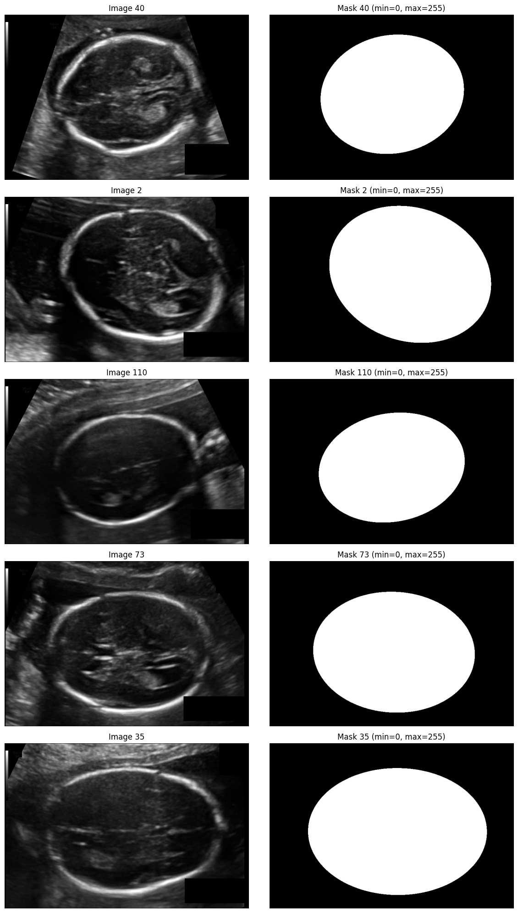

---

### Cine-Loop Pipeline (Our Approach)

```
HC18 Dataset → Pseudo-LDDM Simulation → Preprocessing & Augmentation → 3D U-Net Segmentation
             → Post-Processing → Ellipse Fitting → HC Computation → Temporal Stability Module → Reliability Score
```


---

## Architecture

### Residual U-Net (Baseline)

Standard encoder–decoder with residual skip connections. Each residual block: `BN → ReLU → Conv → BN → ReLU → Conv → Addition`.

- **Input**: 384×256 grayscale ultrasound image
- **Output**: Single-channel sigmoid binary mask
- **Loss**: Hybrid BCE + Dice
- **Optimizer**: Adam with mixed-precision (LossScaleOptimizer)
- **Parameters**: 32.4M


### 3D U-Net (Cine-Loop)

Processes **16-frame clips** with 3D convolutions to learn spatio-temporal skull boundary features.

- **Encoder**: 3D conv blocks + MaxPool3D (spatial-only: `1×2×2`)
- **Decoder**: Transposed conv + skip connections
- **Loss**: Hybrid BCE + Dice
- **Parameters**: 365K (lightweight by design)
- **Training**: Early stopped at epoch 24 (best at epoch 19): Train Dice = 0.948, Val Dice = 0.933

---

## Key Component: Pseudo-LDDM Cine-Loop Simulation

A physics-inspired simulation framework that converts static HC18 images into realistic ultrasound video sequences — without requiring proprietary cine datasets.

Built in four phases, each adding a layer of realism:

### Phase 1 — Basic Motion (Proof of Concept)
Affine transformations (rotation & translation) using sinusoidal functions. Gaussian noise per frame. Establishes the minimum viable motion pipeline.

> **Limitation**: Smooth cyclical motion, no anatomical constraints.

https://github.com/TarunSadarla2606/fetal-head-cine-segmentation/raw/main/results/videos/phase1_basic_motion.mp4

---

### Phase 2 — Anatomical Constraints
Motion split into **rigid** (fetal skull — fixed) and **non-rigid** (soft tissue — elastic) components. Skull segmentation mask constrains deformation to tissue outside bone boundary. Rician speckle noise introduced. Optical flow via `cv2.remap` for pixel-wise coherence.

> **Result**: Anatomically correct motion — rigid skull stays stable, background deforms smoothly.

https://github.com/TarunSadarla2606/fetal-head-cine-segmentation/raw/main/results/videos/phase2_anatomical_constraints.mp4

---

### Phase 3 — Temporal Realism (~30s sequences)
Replaced sinusoidal motion with **cumulative random walk** for long-term probe drift. Sporadic Gaussian spikes injected to simulate fetal "wiggles". Non-cyclical, non-repeating sequences.

> **Result**: Biologically plausible long-duration sequences with unpredictable motion bursts.

https://github.com/TarunSadarla2606/fetal-head-cine-segmentation/raw/main/results/videos/phase3_temporal_dynamics.mp4

---

### Phase 4 — Clinical Fidelity (Full Realism)
**Dynamic acoustic shadowing** behind skull. **Probe jitter** (high-frequency operator tremor). **TGC drift** (time-gain compensation intensity oscillation). Unique non-rigid flow fields per wiggle event.

> **Result**: Highest-fidelity sequences replicating real clinical acquisition challenges.

https://github.com/TarunSadarla2606/fetal-head-cine-segmentation/raw/main/results/videos/phase4_clinical_fidelity.mp4

| Metric | Phase 1 | Phase 4 |
|--------|---------|---------|
| TGV Motion Stability ↓ | 0.00125 | **0.00056** |
| Dice Boundary Stability ↑ | 0.7553 | **0.9088** |
| SSIM ↓ (artifact realism) | 0.705 ± 0.017 | 0.569 ± 0.176 |
| KL Divergence ↑ (texture realism) | 2.9565 | **3.6211** |

---

## Results

### Baseline — Segmentation Inference (Prediction vs Ground Truth)

RAW variant (best performer):
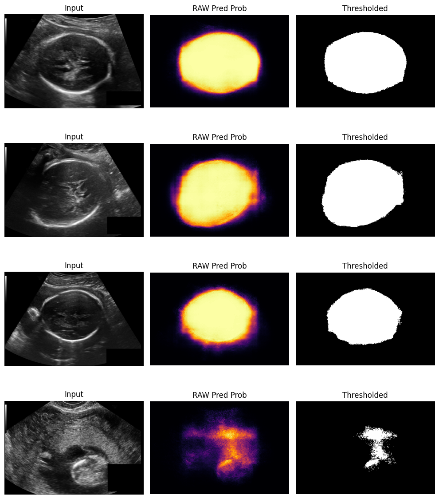

SEG variant:
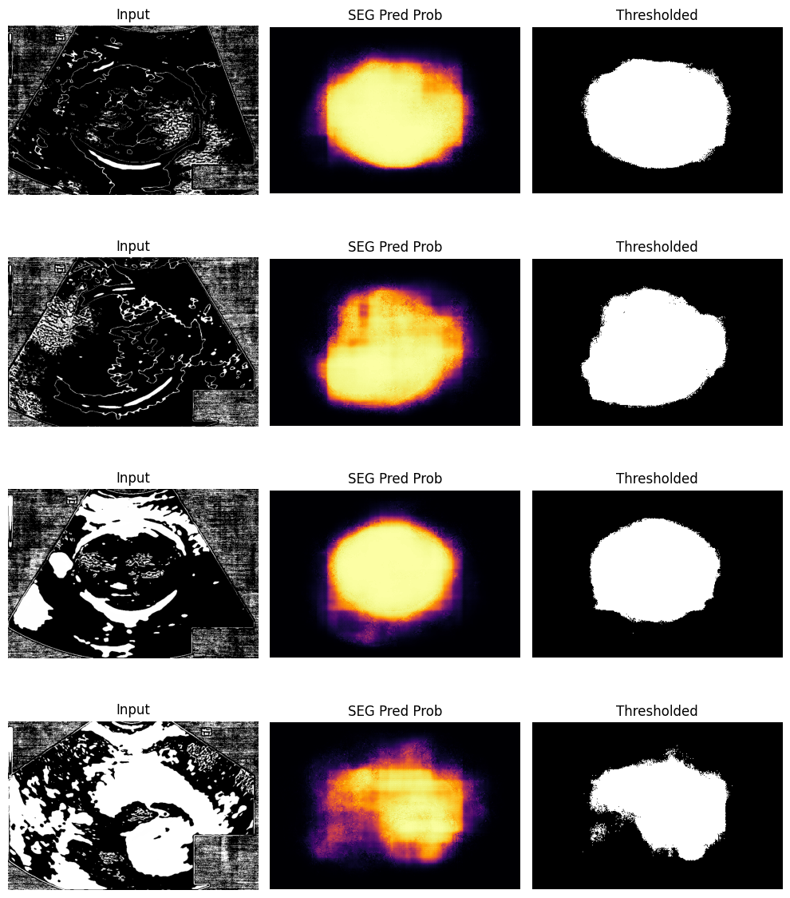

IMP variant:
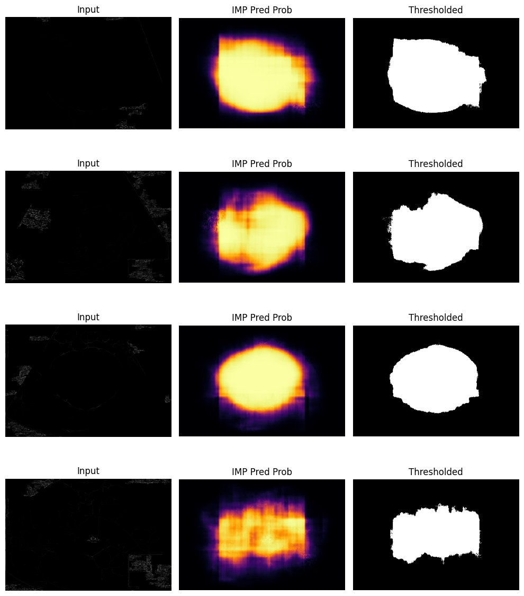

SKL variant (worst performer):
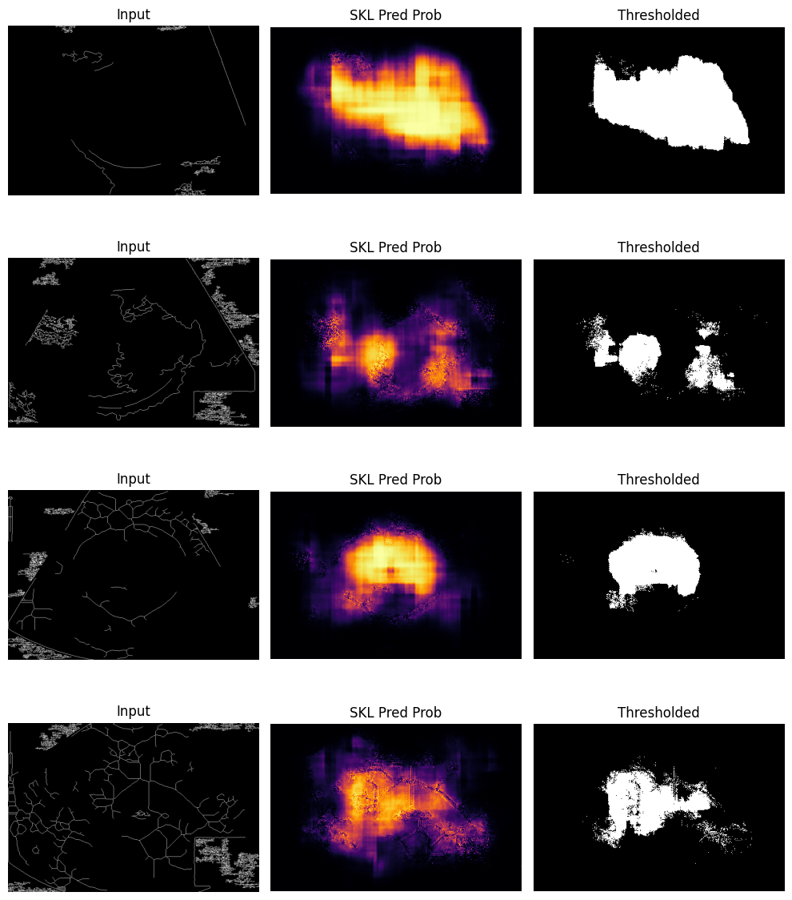

---

### Baseline — Postprocessing (Mask Refinement + Ellipse Fitting)

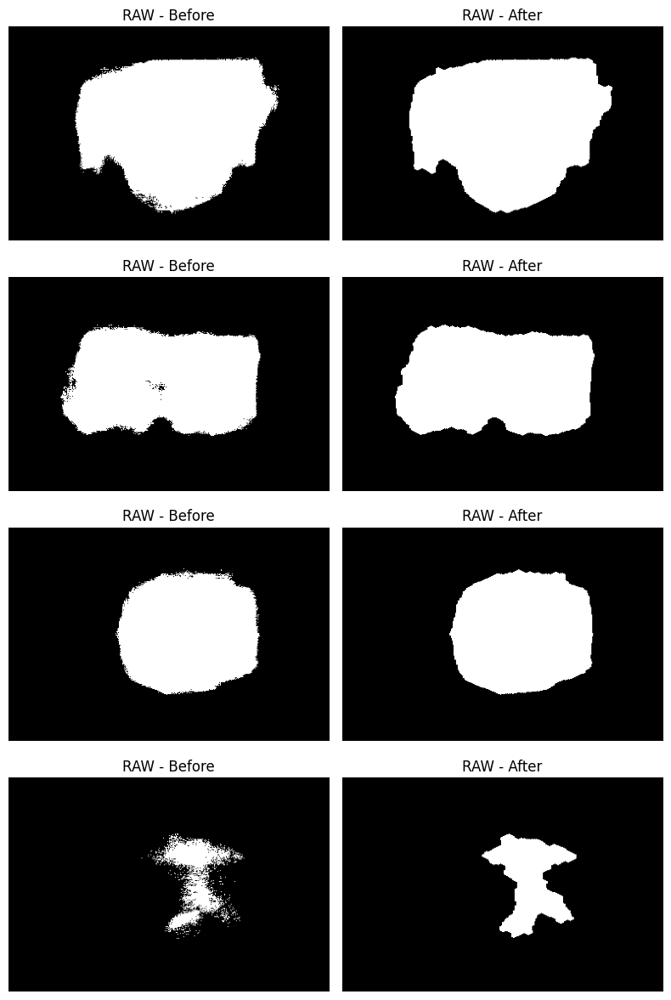
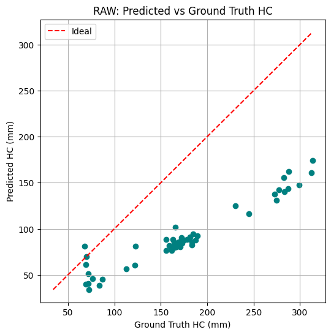

---

### Baseline — Evaluation Metrics Per Model

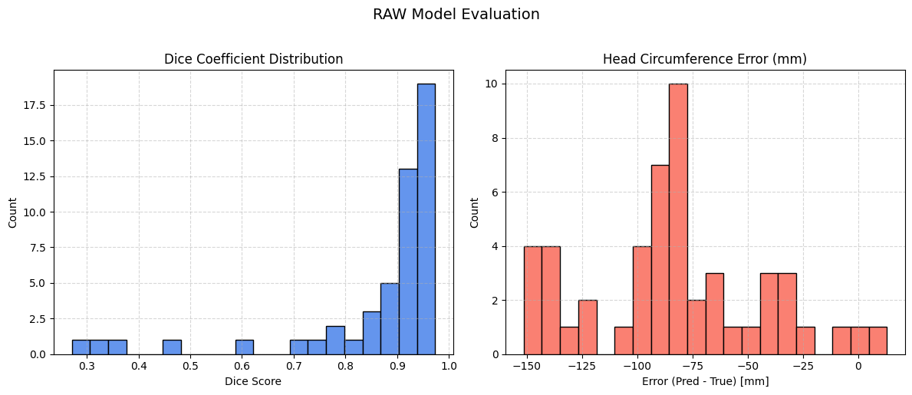
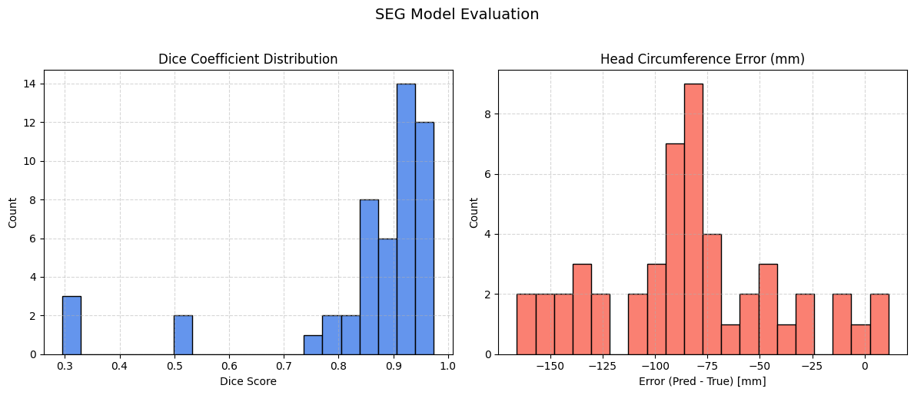
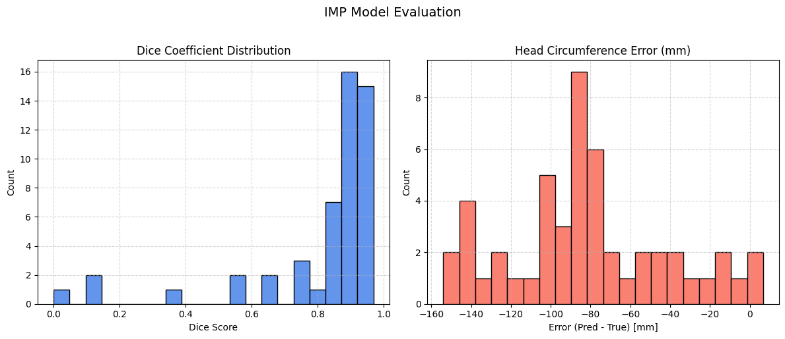
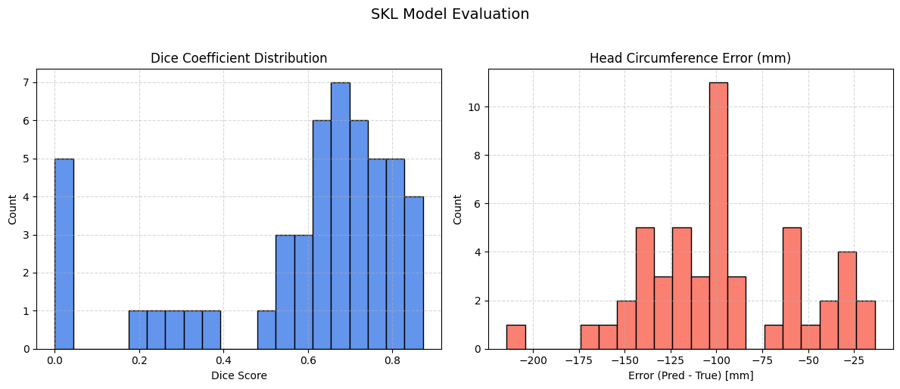

#### Quantitative Summary

| Model Variant | Dice (%) | IoU (%) | MAE (mm) | RMSE (mm) | R² (%) |
|--------------|----------|---------|----------|-----------|--------|
| **RAW ★** | **86.17** | **78.57** | 83.53 | 92.03 | **90.95** |
| SEG | 85.08 | 76.71 | 83.96 | 93.68 | 88.09 |
| IMP | 81.22 | 72.52 | **82.25** | **91.34** | 85.73 |
| SKL | 58.68 | 45.17 | 96.48 | 105.89 | 73.58 |

> **Key finding**: RAW (minimal preprocessing) outperformed all variants on Dice and R², suggesting heavy preprocessing distorts the subtle boundary features the model depends on.

---

### Multi-model Comparison (All Variants)


---

### Cine-Loop System — HC Prediction vs Ground Truth

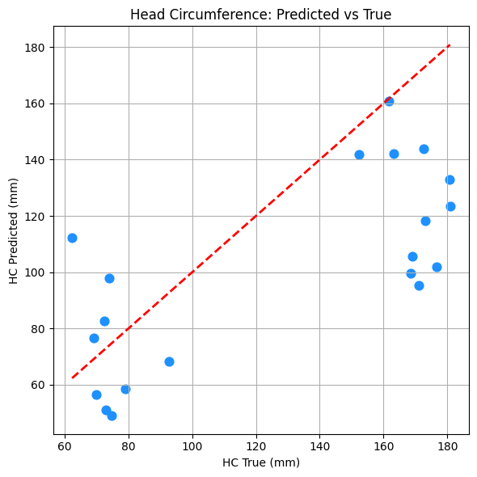

### Cine-Loop System — HC Error Distribution

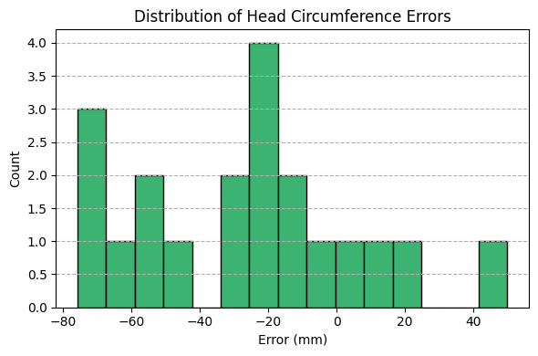

Also from GitHub results:


#### Cine-Loop Qualitative Breakdown (20 test cases)

| Dice Range | Classification | Cases | Interpretation |
|------------|---------------|-------|----------------|
| 0.75 – 0.90 | Excellent | 4 | Very accurate segmentation |
| 0.60 – 0.75 | Good | 5 | Usable but imperfect |
| 0.40 – 0.60 | Moderate | 5 | Boundary issues |
| 0.20 – 0.40 | Weak | 4 | Partial failures |
| < 0.20 | Failed | 2 | Skull not detected |

> **Key finding**: Near-zero temporal standard deviation (≈0 mm) across all test sequences → reliability score 1.0 for all cases. Temporal stability confirmed; segmentation accuracy is the primary bottleneck.

---

### Comparative Summary

| Metric | Published Baseline | Our Baseline | Our Cine-Loop* |
|--------|--------------------|--------------|----------------|
| Dice (%) | 97.89 | 86.17 | 56.53 |
| MAE (mm) | 5.95 | 17.25 | 25.95 |
| Temporal Std (mm) | N/A | N/A | ≈ 0.0 |
| Reliability Score | N/A | N/A | 1.0 |

*Cine-loop constrained to 400/999 samples and 384×256 resolution due to Kaggle disk limits (20GB). Performance gap is a data/compute constraint, not an architectural one.

---

## Dataset

**HC18 Challenge Dataset** — 1,334 fetal head ultrasound images (800×540 px) from 551 pregnancies, Radboud University Medical Center.

- Training: 999 images (with HC annotations)
- Test: 335 images
- Splits used: 75% train / 20% val / 5% test

📥 Download: [HC18 on Kaggle](https://www.kaggle.com/datasets/sahliz/hc18) *(do not commit raw data to this repo)*

---

## Repo Structure

```
fetal-head-cine-segmentation/
├── README.md
├── requirements.txt
├── .gitignore
├── data/
│   └── README.md                    # Dataset download instructions
├── src/
│   ├── pseudo_lddm.py               # Cine-loop simulation (Phase 1–4)
│   ├── preprocess_baseline.py       # Static-frame preprocessing pipeline
│   ├── preprocess_cine.py           # Sequence-consistent preprocessing
│   ├── residual_unet.py             # Residual U-Net (baseline model)
│   ├── unet_3d.py                   # 3D U-Net (cine-loop model)
│   ├── train.py                     # Training script (both models)
│   ├── evaluate.py                  # Dice, IoU, MAE, RMSE, R², reliability
│   └── postprocess.py               # Mask refinement + ellipse HC computation
├── notebooks/
│   ├── fh-baseline.ipynb            # Full baseline pipeline (Kaggle)
│   └── cineloops.ipynb              # Full cine-loop pipeline (Kaggle)
├── results/
│   ├── figures/                     # All result images and pipeline diagrams
│   └── videos/                      # Pseudo-LDDM phase output videos
│       ├── phase1_basic_motion.mp4
│       ├── phase2_anatomical_constraints.mp4
│       ├── phase3_temporal_dynamics.mp4
│       └── phase4_clinical_fidelity.mp4
```

---

## Environment

All experiments run on **Kaggle** (dual NVIDIA T4 GPUs, 16GB GDDR6 each, mixed-precision training).

```bash
pip install -r requirements.txt
```

Key dependencies: `tensorflow`, `opencv-python`, `scikit-image`, `scipy`, `numpy`, `pandas`, `matplotlib`, `tqdm`

---

## Training Configuration

```
# Baseline Residual U-Net
Epochs: 50 | Batch: 16 | LR: 3e-5 | Input: 384×256 | Loss: BCE + Dice

# Cine-Loop 3D U-Net
Clips: 16 frames | Input: 384×256 grayscale | Loss: hybrid BCE + Dice
Early stopping on val_loss | ReduceLROnPlateau patience=2
Best checkpoint: epoch 19/30 | Train Dice: 0.948 | Val Dice: 0.933
```

---

## Limitations & Future Work

- **Data scale**: Cine-loop system trained on 400/999 samples due to Kaggle storage limits. Scaling to full dataset at 768×512 resolution is the primary next step.
- **Pseudo-LDDM vs real motion**: Simulation uses engineered physics rules rather than learned tissue mechanics. Future: Semi-LDDM using lightweight optical flow network trained on a small real video dataset (e.g., FPUS23).
- **HC underestimation**: Systematic underestimation for larger heads (>150mm) — boundary under-segmentation. Shape priors or stronger boundary supervision needed.
- **Clinical validation**: Visual Turing Test with certified sonographers to evaluate synthetic cine realism vs real clinical video.

---

## Citation

HC18 Dataset:
> van den Heuvel, T.L.A., et al. "Automated measurement of fetal head circumference using 2D ultrasound images." *PLOS ONE*, 2018.
