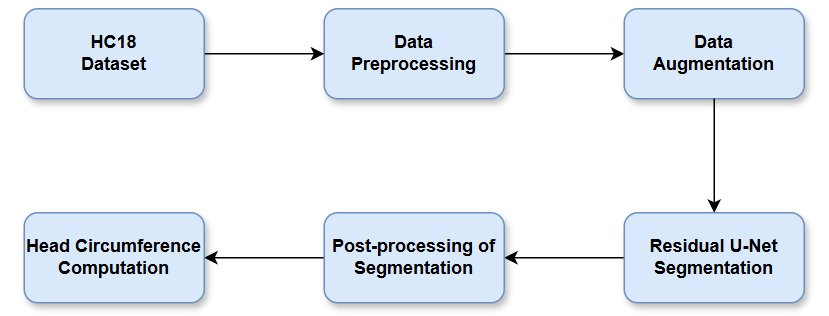
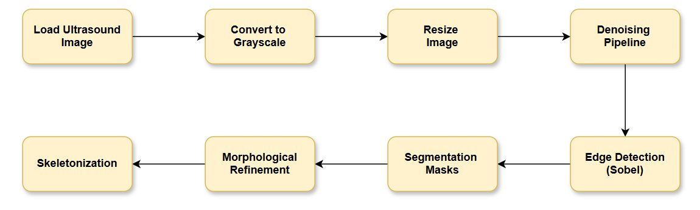
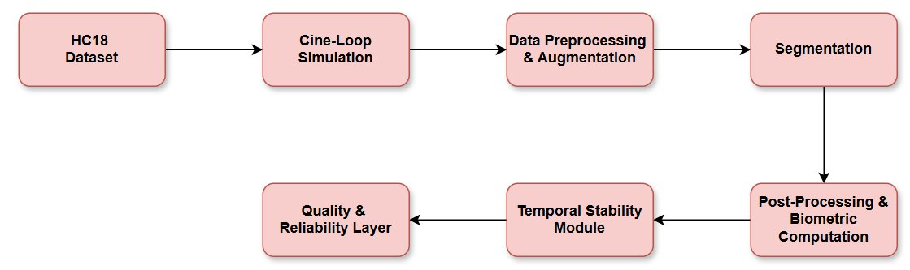
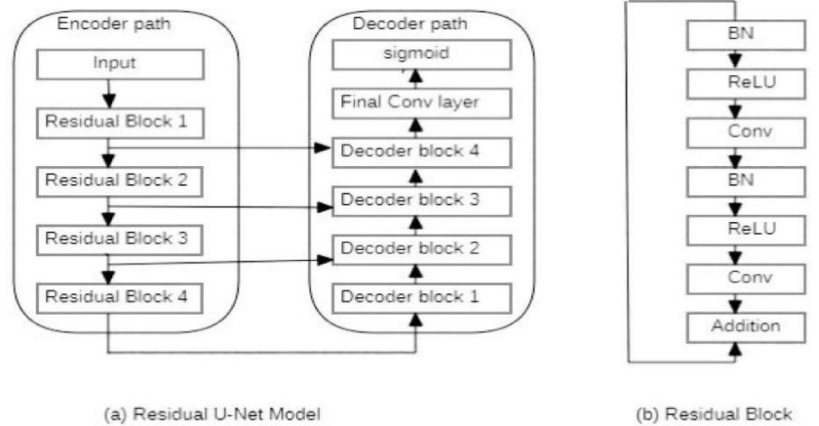
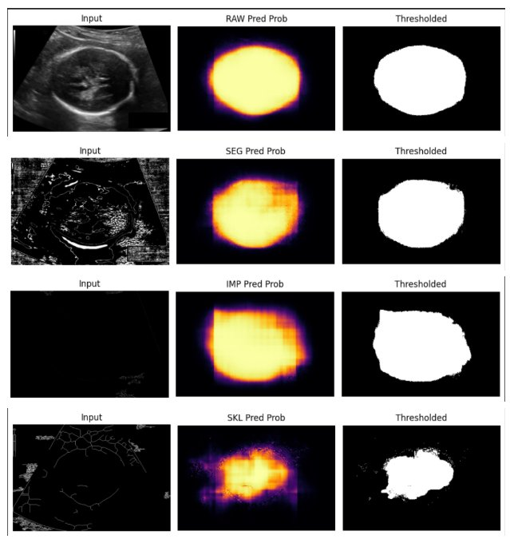
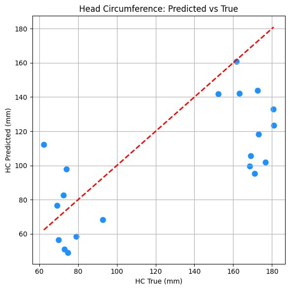

# Fetal Head Circumference Estimation via Cine-Loop Segmentation

> **Course Project — CSCE 6260, Fall 2025**  
> Tarun Sadarla · Ramyasri Murugesan · University of North Texas

---

## Overview

Manual fetal head circumference (HC) measurement from 2D ultrasound is subjective and prone to inter-observer variability. This project builds an end-to-end pipeline that extends **static-frame segmentation to temporally-aware cine-loop analysis**, improving measurement consistency across sequential ultrasound frames.

Two parallel systems were developed and compared:

| System | Approach | Best Dice | HC MAE |
|---|---|---|---|
| **Baseline** | Residual U-Net on static HC18 frames | 87.56% | 17.25 mm |
| **Ours (Cine-Loop)** | 3D U-Net + Pseudo-LDDM simulation | 90.88% (boundary Dice) | 25.95 mm (400 samples) |

---

## Pipeline

### Baseline Pipeline
```
HC18 Dataset → Preprocessing → Data Augmentation → Residual U-Net → Post-Processing → HC Computation
```


**Preprocessing steps:** grayscale conversion → resize → median/Gaussian/Wiener denoising → Sobel edge detection → k-means clustering → morphological refinement → skeletonization



### Cine-Loop Pipeline (Our Approach)
```
HC18 Dataset → Cine-Loop Simulation → Preprocessing & Augmentation → 3D U-Net Segmentation
              → Post-Processing & Biometric Computation → Temporal Stability Module → Quality & Reliability Layer
```


---

## Architecture

### Residual U-Net (Baseline)
Standard encoder–decoder with residual skip connections. Each residual block follows: `BN → ReLU → Conv → BN → ReLU → Conv → Addition`.



### 3D U-Net (Cine-Loop)
Processes **16-frame clips** with 3D convolutions to learn spatio-temporal skull boundary features. Trained with **hybrid BCE + Dice loss**.

- Encoder: 3D conv blocks + MaxPool3D (spatial only: `1×2×2`)
- Decoder: Transposed conv + skip connections
- Output: Per-frame binary segmentation mask

---

## Key Components

### Pseudo-LDDM — Cine-Loop Simulation
A lightweight physics-inspired simulation framework that converts static HC18 images into realistic ultrasound video sequences — without requiring proprietary cine datasets.

Three levels of realism:
1. **Anatomically Constrained Motion** — rigid probe motion (translation, rotation, zoom) + non-rigid deformations constrained by skull mask
2. **Hierarchical Temporal Dynamics** — short-term sinusoidal flicker + long-term stochastic probe drift
3. **Artifact-Aware Perturbation** — Rician speckle noise, dynamic shadow gradients, TGC intensity drift

| Metric | Phase 1 (Baseline) | Phase 4 (Optimized) |
|---|---|---|
| TGV (Motion Stability ↓) | 0.00125 | **0.00056** |
| Dice Boundary Stability ↑ | 0.7553 | **0.9088** |
| SSIM ↓ (artifact realism) | 0.705 ± 0.017 | 0.569 ± 0.176 |
| KL Divergence ↑ (texture realism) | 2.9565 | **3.6211** |

### Temporal Stability Module
Frame-to-frame HC consistency enforced implicitly through 3D U-Net volumetric convolutions. Temporal standard deviation across predicted HC values was **≈ 0 mm** on all test sequences, yielding reliability scores of **1.0**.

### Quality & Reliability Layer
Reliability score = `1 / (1 + temporal_std)`. Flags sequences with unstable predictions and reports per-frame metrics rather than aggregate values.

---

## Results

### Baseline — Model Variant Comparison

| Model Variant | Dice (%) | IoU (%) | MAE (mm) | RMSE (mm) | R² (%) |
|---|---|---|---|---|---|
| RAW | **86.17** | **78.57** | 83.53 | 92.03 | **90.95** |
| SEG | 85.08 | 76.71 | 83.96 | 93.68 | 88.09 |
| IMP | 81.22 | 72.52 | **82.25** | **91.34** | 85.73 |
| SKL | 58.68 | 45.17 | 96.48 | 105.89 | 73.58 |

> RAW (minimal preprocessing) achieved the best overall performance, suggesting heavy preprocessing can distort boundary features.

### Segmentation Outputs Across Variants


### Cine-Loop — HC Prediction vs Ground Truth (20 held-out cases)


### HC Error Distribution


**Key findings:**
- 45–50% of test cases fall in the good-to-excellent Dice range (≥ 0.60)
- Systematic HC underestimation for larger heads (>150 mm) — due to boundary under-segmentation
- Temporal stability is near-perfect; primary bottleneck is segmentation accuracy

---

## Dataset

**HC18 Challenge Dataset** — 1,334 fetal head ultrasound images (800×540 px) from 551 pregnancies, Radboud University Medical Center.

- Training: 999 images (with HC annotations)
- Test: 335 images
- Splits used: 75% train / 20% val / 5% test

📥 Download: [HC18 on Kaggle](https://www.kaggle.com/datasets/sahliz/hc18) *(do not commit raw data to this repo)*

---

## Repo Structure

```
fetal-head-cine-segmentation/
├── README.md
├── requirements.txt
├── .gitignore
├── data/
│   └── README.md              # Dataset download instructions
├── src/
│   ├── pseudo_lddm.py         # Cine-loop simulation (Phase 1–4)
│   ├── preprocess_baseline.py # Static-frame preprocessing pipeline
│   ├── preprocess_cine.py     # Sequence-consistent preprocessing
│   ├── residual_unet.py       # Residual U-Net (baseline model)
│   ├── unet_3d.py             # 3D U-Net (cine-loop model)
│   ├── train.py               # Training script (both models)
│   ├── evaluate.py            # Dice, IoU, MAE, RMSE, R², reliability
│   └── postprocess.py         # Mask refinement + ellipse-based HC computation
├── notebooks/
│   ├── fh-baseline.ipynb      # Baseline pipeline (Kaggle)
│   └── cineloops.ipynb        # Cine-loop pipeline (Kaggle)
├── results/figures/               # All result images
```

---

## Environment

All experiments run on **Kaggle** (dual NVIDIA T4 GPUs, 16GB GDDR6 each, mixed-precision).

```bash
pip install -r requirements.txt
```

Key dependencies: `tensorflow`, `opencv-python`, `scikit-image`, `scipy`, `numpy`, `pandas`, `matplotlib`, `tqdm`

---

## Training

```python
# Baseline Residual U-Net
# Epochs: 50 | Batch: 16 | LR: 3e-5 | Input: 384×256 | Loss: BCE + Dice

# Cine-Loop 3D U-Net
# Clips: 16 frames | Input: grayscale | Loss: hybrid BCE + Dice
# Early stopping on val_loss | ReduceLROnPlateau patience=2
```

---

## My Contributions

This is a group project (2 members). My contributions:
- Residual U-Net implementation and training across all 4 input variants
- Pseudo-LDDM cine-loop simulation framework (all 4 phases)
- 3D U-Net architecture design and training pipeline
- Post-processing pipeline and ellipse-based HC computation
- Temporal stability module and quality/reliability layer
- Full evaluation pipeline (Dice, IoU, MAE, RMSE, R², scatter/histogram plots)

---

## Limitations & Future Work

- HC underestimation for larger heads — needs stronger boundary supervision or shape priors
- Training limited to 400 cine-loop sequences due to storage constraints on Kaggle
- Future: scale to full dataset at 768×512 resolution, add attention mechanisms, integrate optical-flow-based temporal alignment

---

## Citation

HC18 Dataset:
> van den Heuvel, T.L.A., et al. "Automated measurement of fetal head circumference using 2D ultrasound images." *PLOS ONE*, 2018.
